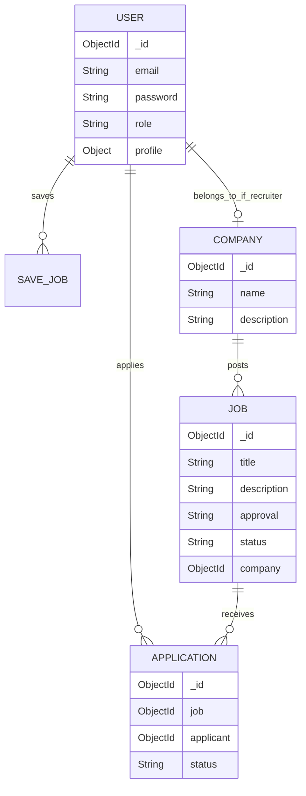
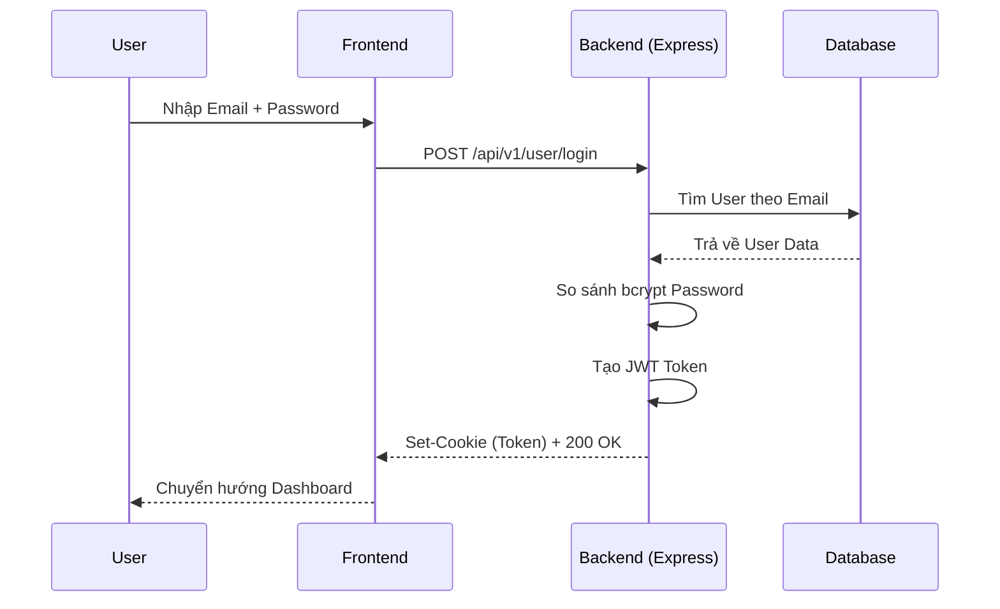

# VieJobs - Nền Tảng Tuyển Dụng Thông Minh Tích Hợp AI

## 1. Tổng quan dự án

- **Mục đích dự án**: VieJobs là một nền tảng tuyển dụng hiện đại (Smart Recruitment Platform) nhằm mục đích kết nối sinh viên (hoặc người tìm việc) với các nhà tuyển dụng một cách hiệu quả và thông minh thông qua việc ứng dụng Trí tuệ nhân tạo (AI).
- **Bài toán giải quyết**: Giảm thiểu thời gian sàng lọc hồ sơ cho nhà tuyển dụng và giúp ứng viên tìm được công việc phù hợp nhất với năng lực và tính cách của mình. Dự án giải quyết các vấn đề cồng kềnh trong quá trình tuyển dụng truyền thống bằng cách tự động hóa đánh giá CV và gợi ý việc làm.
- **Đối tượng sử dụng**:
  - **Ứng viên (Student)**: Tìm kiếm việc làm, tạo/quản lý CV, làm bài test tính cách, nhận tư vấn AI.
  - **Nhà tuyển dụng (Recruiter)**: Đăng tin tuyển dụng, quản lý hồ sơ ứng viên, sử dụng AI để đánh giá mức độ phù hợp.
  - **Quản trị viên (Admin)**: Kiểm duyệt tin tuyển dụng, quản lý tài khoản người dùng và bài viết (blog).

---

## 2. Công nghệ sử dụng

Dự án áp dụng mô hình công nghệ hiện đại, phân tách rõ ràng giữa Frontend và Backend.

### Frontend
- **React (v19)** & **Vite**: Xây dựng giao diện người dùng (UI) hiệu năng cao, render nhanh.
- **TypeScript**: Giúp kiểm soát kiểu dữ liệu chặt chẽ, giảm thiểu lỗi trong quá trình phát triển.
- **Redux Toolkit** & **Redux Persist**: Quản lý trạng thái (State Management) tập trung và lưu trữ cục bộ.
- **Tailwind CSS** & **Radix UI**: Xây dựng hệ thống UI Components linh hoạt, có khả năng tùy biến cao và hỗ trợ chuẩn Accessibility.
- **Framer Motion**: Tạo các hiệu ứng chuyển động mượt mà cho UI.

### Backend
- **Node.js** & **Express (v5)**: Xây dựng RESTful API tốc độ cao, kiến trúc Non-blocking I/O.
- **Mongoose**: Object Data Modeling (ODM) để tương tác với MongoDB.

### Database & Storage
- **MongoDB**: Cơ sở dữ liệu NoSQL lưu trữ toàn bộ dữ liệu người dùng, công việc, hồ sơ.
- **Pinecone Database**: Vector Database phục vụ cho việc tính toán độ tương đồng (semantic search/matching) giữa CV và yêu cầu công việc.
- **Cloudinary**: Lưu trữ trực tuyến tối ưu hóa cho hình ảnh và file (PDF, Docs).

### AI & Xử lý Dữ liệu
- **@google/genai & openai**: Tích hợp các mô hình ngôn ngữ lớn (LLM) để phân tích CV, chatbot hỗ trợ, và đánh giá bài test MBTI/MI.
- **Tesseract.js** & **pdf-parse**: Trích xuất văn bản (OCR) từ hình ảnh và file PDF CV của ứng viên để AI phân tích.

### Công nghệ khác
- **Authentication**: JWT (JSON Web Token), bcryptjs để băm mật khẩu.
- **Background Jobs/Queue**: `node-cron` để thiết lập các tác vụ tự động theo lịch (ví dụ: thông báo).
- **DevOps**: Docker & Docker Compose để container hóa ứng dụng, giúp triển khai đồng nhất.

---

## 3. Kiến trúc hệ thống

- **Kiến trúc tổng thể**: Client-Server (SPA - Single Page Application kết nối tới RESTful API).
- **Luồng xử lý request**: Request từ trình duyệt -> Express Router -> Middleware (Auth/Validation/Upload) -> Controller -> Service/AI -> Mongoose Model -> MongoDB -> Trả về Response.
- **Luồng dữ liệu AI**: Người dùng upload CV -> Lưu tạm bằng Multer -> Trích xuất text bằng pdf-parse/tesseract -> Đẩy dữ liệu thô cho Gemini/OpenAI phân tích -> Vector hóa (Embeddings) và lưu Pinecone -> Trả kết quả đánh giá cho người dùng.

```mermaid
graph TD
    Client[Client (React + Vite)] -->|HTTP/REST| API[API Gateway (Express)]
    
    subgraph Backend
        API --> AuthMW[Auth Middleware]
        AuthMW --> Controllers[Controllers]
        Controllers --> Services[Business/AI Services]
        Controllers --> DBModels[Mongoose Models]
    end
    
    Services -->|Extract Text| PDF[pdf-parse / tesseract]
    Services -->|Prompt| LLM[Gemini / OpenAI]
    Services -->|Vector Matching| Pinecone[(Pinecone Vector DB)]
    
    DBModels --> MongoDB[(MongoDB)]
    Controllers -->|Upload| Cloudinary[(Cloudinary)]
```

---

## 4. Cấu trúc thư mục

```text
VieJobs/
├── be/ (Backend)
│   ├── src/
│   │   ├── controllers/   # Xử lý logic của từng API endpoint
│   │   ├── middleware/    # Auth, Multer (xử lý file upload)
│   │   ├── models/        # Định nghĩa Mongoose Schema (User, Job,...)
│   │   ├── routes/        # Định nghĩa các route API
│   │   ├── services/      # Các service phụ trợ (vd: cron job notifications)
│   │   ├── uploads/       # Thư mục tạm lưu file upload trước khi đẩy lên Cloud
│   │   ├── utils/         # Kết nối DB và các hàm helper
│   │   └── server.js      # Entry point của ứng dụng backend
├── fe/ (Frontend)
│   ├── src/
│   │   ├── components/    # Reusable UI components (Shared, UI, Layouts)
│   │   ├── hooks/         # Custom React hooks
│   │   ├── lib/           # Cấu hình các thư viện bên thứ 3
│   │   ├── pages/         # Các trang chính của ứng dụng
│   │   ├── redux/         # Setup Store, Reducers, Actions
│   │   ├── types/         # TypeScript interfaces/types
│   │   └── utils/         # Các hàm tiện ích dùng chung ở frontend
└── docker-compose.yml     # File cấu hình khởi chạy toàn bộ stack bằng Docker
```

---

## 5. Database

Hệ thống sử dụng MongoDB với các Collection chính:

- **Users**: Lưu thông tin đăng nhập, vai trò (student, recruiter, admin), và profile chi tiết (skills, bio, resume URL).
- **Companies**: Hồ sơ công ty, logo, mô tả, địa chỉ.
- **Jobs**: Lưu thông tin tuyển dụng, mức lương, yêu cầu, trạng thái duyệt (pending/approved), status (active/closed).
- **Applications**: Quản lý việc ứng tuyển (Ref tới User và Job), trạng thái (pending/accepted/rejected).
- **Resumes**: Quản lý các mẫu CV hoặc CV đã tạo của ứng viên.
- **Blogs**: Bài viết/Tin tức chia sẻ trên hệ thống.
- **Notifications**: Lưu trữ các thông báo gửi đến người dùng.
- **SaveJobs & SearchHistories**: Lưu lại lịch sử và hành vi của người dùng để cá nhân hóa.



---

## 6. Chức năng hệ thống

| Chức năng | Mô tả | Các Module Liên Quan |
|---|---|---|
| **Quản lý Tài Khoản** | Đăng ký, đăng nhập, quên mật khẩu. Phân quyền (Student, Recruiter, Admin). | Auth, User Model |
| **Quản lý Hồ Sơ (Profile)** | Ứng viên cập nhật thông tin cá nhân, kỹ năng, tải lên CV (PDF). | User Controller, Cloudinary, Multer |
| **Đăng Tin Tuyển Dụng** | Recruiter tạo tin. Job sẽ ở trạng thái `pending` chờ Admin duyệt. | Job Controller, Admin Route |
| **Kiểm Duyệt Job (Admin)** | Admin xem danh sách Job pending và Approve/Reject. | Admin Controller, Job Model |
| **Tìm Kiếm Việc Làm** | Ứng viên tìm job theo từ khóa, ngành nghề, địa điểm, mức lương. | Job Controller, SearchHistory |
| **Ứng Tuyển Công Việc** | Ứng viên nộp CV vào Job. Hệ thống lưu Application. | Application Controller |
| **Quản Lý Ứng Viên** | Recruiter xem danh sách CV đã nộp, duyệt (Accept) hoặc từ chối (Reject) kèm thông báo. | Application Controller, Notification |
| **AI Đánh Giá CV** | Phân tích CV qua AI (Gemini/OpenAI) để chỉ ra điểm mạnh, điểm yếu và mức độ phù hợp với công việc. | AI Route, Tesseract, pdf-parse |
| **Trắc Nghiệm Tính Cách** | Bài test MBTI và Trí thông minh đa giá trị (MI) để AI tư vấn nghề nghiệp. | MBTI Route, MI Route |
| **Blog & Thông báo** | Quản lý bài viết và hệ thống thông báo realtime (cron job). | Blog Route, Notification Service |

---

## 7. API Documentation

*Bảng mô tả một số API cốt lõi trong hệ thống.*

| Method | URL | Mô tả | Auth | Request Body | Response | Status Code |
|---|---|---|---|---|---|---|
| POST | `/api/v1/user/login` | Đăng nhập hệ thống | No | `{ email, password, role }` | User Info + JWT Cookie | 200 / 400 |
| POST | `/api/v1/user/register` | Đăng ký tài khoản | No | `{ fullname, email, password, phoneNumber, role }` | Success Message | 201 / 400 |
| POST | `/api/v1/job/post` | Đăng tin tuyển dụng | Recruiter | `{ title, description, requirements, salary... }` | Created Job Object | 201 / 401 / 403 |
| GET | `/api/v1/job/get` | Lấy danh sách Job | No | N/A | Array of Jobs | 200 |
| POST | `/api/v1/application/apply/:id` | Nộp CV ứng tuyển | Student | Multipart/Form-data (CV file) | Application Object | 201 / 404 |
| GET | `/api/v1/admin/jobs/pending` | Lấy Jobs chờ duyệt | Admin | N/A | Array of Pending Jobs | 200 / 403 |
| POST | `/api/v1/ai/review-cv` | AI đánh giá CV | Yes | Multipart/Form-data (CV file) | AI Assessment Text | 200 / 500 |

---

## 8. Authentication & Authorization

- **Cơ chế đăng nhập**: Hệ thống sử dụng JWT (JSON Web Token). Access Token được lưu trữ bảo mật dưới dạng `HttpOnly Cookie`. 
- **Mã hóa mật khẩu**: Sử dụng `bcryptjs` để băm mật khẩu trước khi lưu vào database, chống lộ lọt dữ liệu.
- **Phân quyền (RBAC)**: Dựa trên thuộc tính `role` trong Mongoose model (`student`, `recruiter`, `admin`).
- **Middleware Xác Thực**: File `be/src/middleware/auth.middleware.js` làm nhiệm vụ đọc Cookie, xác thực token bằng `SECRET_KEY`, lấy ID người dùng và kiểm tra quyền truy cập tương ứng với từng API route.

---

## 9. Business Logic

- **Module Đăng Tuyển**: 
  - Recruiter gửi request tạo job -> Hệ thống lưu job với `approval: "pending"`.
  - Admin sẽ gọi API duyệt. Nếu `approved`, job sẽ hiển thị public (`status: "active"`).
- **Module Ứng Tuyển**: 
  - Ứng viên nộp đơn -> Tạo bản ghi trong `Application` model.
  - Recruiter có thể lọc đơn, chuyển trạng thái thành `accepted` hoặc `rejected`.
  - Node-cron scheduler sẽ tự động gửi email/thông báo đến ứng viên về sự thay đổi trạng thái đơn.
- **Module Trắc Nghiệm AI**:
  - Ứng viên hoàn thành test MBTI/MI -> Hệ thống lấy mảng kết quả gửi lên LLM (Gemini) kèm prompt được thiết kế sẵn -> Trả về bản phân tích tính cách và gợi ý nghề nghiệp.

---

## 10. Luồng xử lý

### Luồng Đăng nhập


---

## 11. Bảo mật

- **Password Hashing**: Mật khẩu người dùng hoàn toàn không lưu plaintext, được hash bằng `bcryptjs`.
- **JWT (JSON Web Token)**: Ngăn chặn tấn công bằng cách sử dụng secret keys mạnh, giới hạn thời gian sống của token (có tích hợp Refresh token logic).
- **CORS**: Được config chặn các nguồn không xác định, chỉ cho phép request từ `URL_CLIENT` (vd: `http://localhost:5173`).
- **Rate Limit**: Sử dụng `express-rate-limit` để ngăn chặn tấn công Brute-force hoặc DDoS lớp ứng dụng (layer 7).
- **File Validation**: `multer` chặn các định dạng file không được phép, đảm bảo chỉ upload ảnh hoặc pdf.

---

## 12. Xử lý lỗi

- **Exception Handling**: Sử dụng Global Error Handler tại `be/src/server.js`. Bất kỳ lỗi nào phát sinh (throw Error) đều được catch và trả về format chung `{ message: "..." }`.
- **Môi trường**: Trong môi trường `production`, chi tiết lỗi sẽ được ẩn ("Internal server error") để tránh lộ lọt cấu trúc code, trong khi ở `development` sẽ trả về `err.message`.

---

## 13. Biến môi trường

| Biến | Môi Trường | Mô tả |
|---|---|---|
| `MONGO_URI` | Backend | Chuỗi kết nối đến MongoDB Atlas. |
| `PORT` | Backend | Cổng chạy server (mặc định: 8000). |
| `URL_CLIENT` / `FRONTEND_URL` | Backend | URL của Frontend để config CORS. |
| `SECRET_KEY` / `REFRESH_SECRET_KEY` | Backend | Khóa bí mật để ký JWT. |
| `EMAIL_USER` / `EMAIL_PASSWORD` | Backend | Cấu hình Nodemailer để gửi email tự động. |
| `CLOUD_NAME`, `API_KEY`, `API_SECRET` | Backend | Thông tin cấu hình SDK Cloudinary. |
| `OPENAI_API_KEY` / `GEMINI_API_KEY_*` | Backend | Khóa API để gọi dịch vụ AI. |
| `PINECONE_API_KEY` | Backend | Khóa kết nối Vector Database. |
| `VITE_API_URL` | Frontend | (Khuyến nghị) Đường dẫn API cho Axios. |


---

## 14. Điểm mạnh của dự án

- **Kiến trúc rõ ràng**: Tách biệt hoàn toàn Frontend/Backend, sử dụng kiến trúc chuẩn dễ tiếp cận cho team quy mô vừa và nhỏ.
- **Tiên phong áp dụng AI**: Không chỉ là CRUD app cơ bản, VieJobs mang lại giá trị thực với LLM (đánh giá CV, test MBTI) và Vector Search.
- **Trải nghiệm người dùng (UX)**: Giao diện sử dụng Radix UI và Framer Motion đem lại cảm giác mượt mà, chuyên nghiệp (premium feel).
- **Tính tự động hóa cao**: Hệ thống duyệt Job tự động, CronJob gửi email nhắc nhở định kỳ.

---

## 15. Hạn chế

- Phụ thuộc mạnh vào 3rd-party API (Gemini/OpenAI/Pinecone), có thể gặp vấn đề về rate-limit hoặc chi phí nếu scale lớn.
- Việc xử lý PDF nội bộ bằng OCR (Tesseract) có thể tốn CPU trên server Node.js.
- Chưa có giải pháp Caching (như Redis) khiến các query lặp đi lặp lại vào MongoDB có thể giảm hiệu năng khi có hàng triệu user.
- Thiếu Message Queue thực sự (như RabbitMQ/Kafka) để xử lý bất đồng bộ các tác vụ nặng (như gửi email hàng loạt).

---

## 16. Hướng phát triển

- Tối ưu hóa AI bằng cách tách riêng một Microservice (viết bằng Python/FastAPI) chuyên xử lý file và LLM để giảm tải cho Node.js server.
- Bổ sung Caching (Redis) cho các API thường xuyên gọi như `Lấy danh sách Job`.
- Phát triển tính năng Live Chat (Socket.io) giữa Nhà tuyển dụng và Ứng viên.
- Tích hợp cổng thanh toán (VNPay, Momo) để triển khai gói dịch vụ đăng tin "VIP" cho nhà tuyển dụng.

---

## 17. Kết luận

**VieJobs** là một giải pháp tuyển dụng toàn diện, hiện đại. Với việc áp dụng những công nghệ web mạnh mẽ nhất hiện nay (React 19, Express, MongoDB) kết hợp cùng Trí Tuệ Nhân Tạo (Generative AI & Vector Search), dự án đáp ứng xuất sắc bài toán rút ngắn khoảng cách giữa ứng viên và nhà tuyển dụng. Nền tảng có tính khả mở cao, cấu trúc thư mục quy chuẩn, phù hợp để triển khai thực tế cấp doanh nghiệp.
