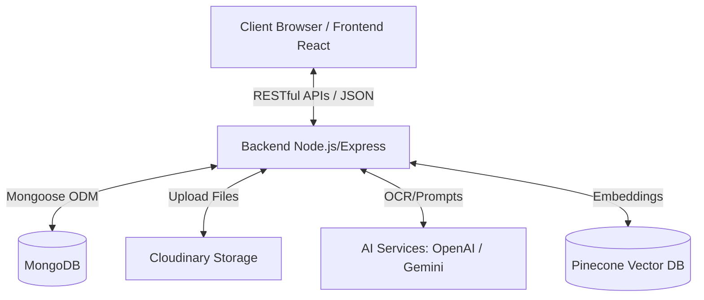
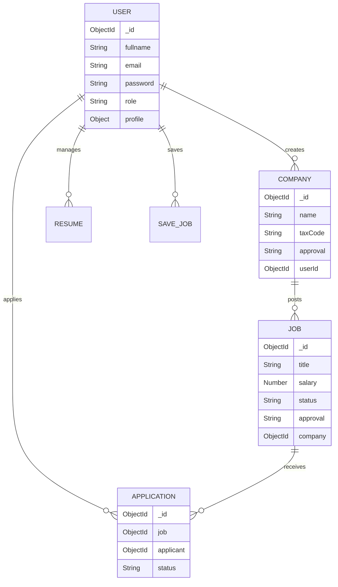
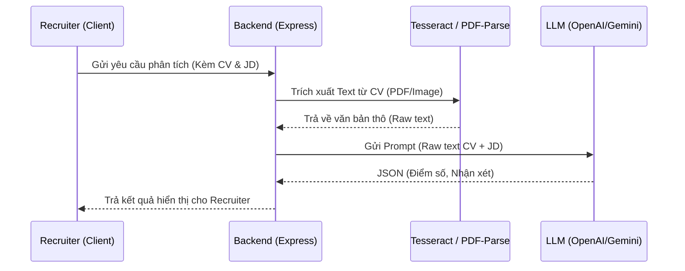

# VieJobs - Nền Tảng Tuyển Dụng Tích Hợp AI

## 1. Tổng quan dự án

### Mục đích dự án
**VieJobs** là một hệ thống ứng dụng web hiện đại phục vụ cho lĩnh vực tuyển dụng nhân sự. Hệ thống được thiết kế để kết nối ứng viên và nhà tuyển dụng, đặc biệt tích hợp các công nghệ Trí tuệ Nhân tạo (AI) để tối ưu hóa quy trình sàng lọc và đánh giá hồ sơ.

### Bài toán giải quyết
- **Đối với ứng viên:** Khó khăn trong việc tìm kiếm việc làm phù hợp, tạo CV và theo dõi tiến độ ứng tuyển. Hệ thống cung cấp công cụ tạo CV, gợi ý việc làm, bài test tính cách (MBTI, MI) để định hướng nghề nghiệp.
- **Đối với nhà tuyển dụng:** Mất nhiều thời gian để sàng lọc hàng trăm CV thủ công. Hệ thống giải quyết bằng tính năng tự động trích xuất thông tin (OCR) và dùng LLM đánh giá độ phù hợp của CV với Yêu cầu công việc (Job Description).
- **Đối với quản trị viên:** Cần một hệ thống quản trị tập trung để kiểm duyệt nội dung (công ty, tin tuyển dụng) và theo dõi thống kê hệ thống.

### Đối tượng sử dụng
- **Ứng viên (Student/Candidate):** Người tìm việc, tạo hồ sơ, ứng tuyển.
- **Nhà tuyển dụng (Recruiter):** Đại diện doanh nghiệp đăng tin tuyển dụng, quản lý ứng viên.
- **Quản trị viên (Admin):** Quản lý toàn bộ hệ thống, kiểm duyệt dữ liệu.

---

## 2. Công nghệ sử dụng

### Frontend (Client-side)
- **Core:** React 19, TypeScript, Vite.
- **Styling/UI:** Tailwind CSS v4, Framer Motion (Animations), Radix UI (Primitives headless components).
- **State Management & Data Fetching:** Redux Toolkit, Redux Persist, React Query (`@tanstack/react-query`).
- **Routing:** React Router DOM v7.
- **Thư viện khác:** 
  - `chart.js` / `recharts`: Vẽ biểu đồ thống kê.
  - `react-leaflet`: Tích hợp bản đồ địa lý.
  - `tinymce`: Rich text editor cho việc soạn thảo bài viết/tin tuyển dụng.
  - `html2pdf.js`: Xuất CV ra file PDF.

### Backend (Server-side)
- **Core:** Node.js, Express 5.
- **Xử lý tài liệu (PDF/Image):** `multer`, `pdf-parse`, `tesseract.js` (OCR), `pdfjs-dist`, `pdf2pic`.
- **Thư viện khác:** `axios`, `node-cron` (Lập lịch tác vụ).

### AI & Search
- **LLMs:** `@google/genai` (Google Gemini), `openai` (GPT).
- **Vector Database:** `@pinecone-database/pinecone` (Lưu trữ và tìm kiếm vector nhúng - embeddings cho việc matching).

### Database & Storage
- **Database:** MongoDB (Sử dụng ODM `mongoose`).
- **Storage:** Cloudinary (Lưu trữ hình ảnh, logo, file CV PDF trên cloud).

### Authentication & Security
- **Authentication:** JSON Web Token (JWT) cho xác thực, `cookie-parser` để quản lý session ở client.
- **Security:** `bcryptjs` (Mã hóa mật khẩu), `cors`, `express-rate-limit` (Chống spam request).

### DevOps & Infrastructure
- **Containerization:** Docker & Docker Compose (Chạy song song Frontend và Backend độc lập).

---

## 3. Kiến trúc hệ thống

### Kiến trúc tổng thể
Hệ thống sử dụng kiến trúc **Client-Server** theo chuẩn RESTful API. 
- Frontend hoạt động như một Single Page Application (SPA), gọi API đến Backend.
- Backend xử lý logic, giao tiếp với MongoDB và các dịch vụ bên thứ 3 (AI, Cloudinary).



### Luồng xử lý request cơ bản
1. **Request:** Client gửi HTTP Request kèm JWT Token (nếu cần xác thực).
2. **Middleware:** Backend nhận request, đi qua các middleware (CORS, Rate Limit, Verify JWT Token).
3. **Controller:** Điều hướng logic đến Controller tương ứng.
4. **Service / Model:** Giao tiếp cơ sở dữ liệu hoặc bên thứ 3 (nếu có).
5. **Response:** Trả về kết quả dưới định dạng JSON cho Client.

---

## 4. Cấu trúc thư mục

### Thư mục Backend (`/be`)
```text
be/
├── src/
│   ├── controllers/   # Xử lý logic nghiệp vụ cho từng endpoint (User, Job, Company...)
│   ├── middleware/    # Các middleware bảo mật, xác thực (auth), xử lý file (multer)
│   ├── models/        # Định nghĩa Schema cho MongoDB bằng Mongoose
│   ├── routes/        # Định nghĩa các HTTP API endpoints và map với controllers
│   ├── services/      # Chứa các service dùng chung (ví dụ: notificationService)
│   ├── uploads/       # Thư mục lưu trữ file tạm thời (nếu có)
│   ├── utils/         # Các hàm tiện ích (kết nối DB, helper functions)
│   └── server.js      # File entry point khởi chạy Express server
├── .env               # Biến môi trường backend
├── Dockerfile         # Cấu hình Docker build cho backend
└── package.json       # Quản lý dependencies backend
```

### Thư mục Frontend (`/fe`)
```text
fe/
├── src/
│   ├── components/    # Các UI component tái sử dụng (chia theo thư mục ui, admin, recruiter...)
│   ├── hooks/         # Các custom React hooks
│   ├── lib/           # Thư viện tiện ích tích hợp cấu hình sẵn
│   ├── redux/         # Cấu hình Redux store và các slices
│   ├── types/         # Định nghĩa TypeScript interfaces/types
│   ├── utils/         # Hàm tiện ích dùng chung
│   ├── App.tsx        # Root component, quản lý Routing
│   ├── main.tsx       # Entry point render ứng dụng React
│   └── index.css      # Style toàn cục (Tailwind)
├── .env               # Biến môi trường frontend
├── vite.config.ts     # Cấu hình trình biên dịch Vite
├── Dockerfile         # Cấu hình Docker build cho frontend
└── package.json       # Quản lý dependencies frontend
```

---

## 5. Database

Hệ thống sử dụng **MongoDB** (NoSQL) với các Collection chính sau:

- **Users:** Lưu trữ thông tin tài khoản, mật khẩu (hash), vai trò (role: student, recruiter, admin), hồ sơ cá nhân (skills, resume, avatar).
- **Companies:** Lưu trữ thông tin công ty (tên, logo, mô tả, website, mã số thuế). Liên kết với User (người tạo). Có trạng thái kiểm duyệt (pending, approved, rejected).
- **Jobs:** Lưu trữ tin tuyển dụng (tiêu đề, mô tả, yêu cầu, lương, địa điểm, trạng thái). Liên kết với Company và User.
- **Applications:** Lưu trữ lịch sử ứng tuyển. Liên kết giữa Job và User (applicant). Quản lý trạng thái ứng tuyển.
- **Resumes:** Quản lý các mẫu CV hoặc file CV upload của ứng viên.
- **Blogs:** Bài viết, tin tức trên nền tảng.
- **Notifications:** Hệ thống thông báo (in-app notifications).
- **SaveJobs:** Các công việc được ứng viên lưu lại.
- **SearchHistories:** Lịch sử tìm kiếm của người dùng.

### Sơ đồ ERD (Entity-Relationship Diagram) cơ bản



---

## 6. Chức năng hệ thống

### Ứng viên (Candidate / Student)
- **Quản lý Tài khoản & Hồ sơ:** Đăng ký, đăng nhập, cập nhật thông tin cá nhân, kỹ năng.
- **Quản lý CV (Resume):** Upload CV file PDF hoặc sử dụng tính năng Resume Builder để tạo CV trực tiếp. Xuất CV ra PDF.
- **Tìm kiếm Việc làm:** Tìm việc theo từ khóa, ngành nghề. Xem chi tiết công việc.
- **Ứng tuyển:** Nộp CV cho các công việc mong muốn. Theo dõi trạng thái hồ sơ (Chờ duyệt, Chấp nhận, Từ chối).
- **Lưu việc làm:** Đánh dấu lưu các tin tuyển dụng quan tâm.
- **Bài trắc nghiệm (MBTI, MI):** Làm bài test để hệ thống gợi ý hướng đi nghề nghiệp phù hợp.

### Nhà tuyển dụng (Recruiter)
- **Đăng ký Công ty:** Tạo profile công ty, nộp hồ sơ xin cấp phép kinh doanh chờ Admin duyệt.
- **Quản lý Tin tuyển dụng:** Đăng tin, chỉnh sửa, đóng/mở tin tuyển dụng. (Tin đăng cũng cần Admin duyệt).
- **Quản lý Ứng viên:** Xem danh sách ứng viên nộp hồ sơ cho từng Job. Đổi trạng thái ứng viên.
- **AI Đánh giá CV:** Sử dụng tính năng AI để chấm điểm (scoring) độ phù hợp của CV ứng viên với Job Description, giúp sàng lọc nhanh chóng.

### Quản trị viên (Admin)
- **Dashboard:** Thống kê tổng quan hệ thống (biểu đồ số lượng user, job, application).
- **Kiểm duyệt Công ty:** Duyệt (approve) hoặc từ chối (reject) yêu cầu tạo công ty của nhà tuyển dụng.
- **Kiểm duyệt Tin tuyển dụng:** Duyệt các tin tuyển dụng trước khi hiển thị ra ngoài cộng đồng.
- **Quản lý Users:** Xem danh sách, khóa/mở khóa tài khoản.

---

## 7. API Documentation (Tóm tắt)

*Dưới đây là một số API chính trong hệ thống:*

| Module | Method | URL | Mô tả | Authentication |
|---|---|---|---|---|
| **Auth** | POST | `/api/v1/user/register` | Đăng ký tài khoản mới | Không |
| **Auth** | POST | `/api/v1/user/login` | Đăng nhập hệ thống | Không |
| **Auth** | POST | `/api/v1/user/logout` | Đăng xuất | Có |
| **Job** | GET | `/api/v1/job/get` | Lấy danh sách việc làm | Tùy chọn |
| **Job** | POST | `/api/v1/job/post` | Đăng tin tuyển dụng | Có (Recruiter) |
| **Company**| POST | `/api/v1/company/register` | Đăng ký công ty | Có (Recruiter) |
| **Company**| GET | `/api/v1/company/get` | Lấy danh sách công ty đã duyệt | Không |
| **Application**| POST | `/api/v1/application/apply/:id` | Nộp đơn ứng tuyển | Có (Student) |
| **Application**| GET | `/api/v1/application/:id/applicants`| Lấy ds ứng viên của Job | Có (Recruiter)|
| **Application**| POST | `/api/v1/application/status/:id`| Cập nhật trạng thái ứng viên | Có (Recruiter)|
| **AI** | POST | `/api/v1/ai/review-cv` | Phân tích và chấm điểm CV bằng AI | Có (Recruiter)|
| **Admin** | POST | `/api/v1/admin/job/approve/:id`| Duyệt tin tuyển dụng | Có (Admin) |

---

## 8. Authentication & Authorization

- **Cơ chế đăng nhập:** Sử dụng JSON Web Token (JWT). Token được tạo ra khi login và lưu vào Cookies (để bảo mật chống XSS) hoặc trả về cho client.
- **Phân quyền (RBAC):** Hệ thống định nghĩa 3 roles: `student`, `recruiter`, `admin`.
- **Middleware xác thực:** Các middleware (như `isAuthenticated`) kiểm tra tính hợp lệ của JWT token ở các route được bảo vệ. Middleware kiểm tra Role để đảm bảo quyền truy cập (ví dụ: chỉ Admin mới truy cập được các route `/api/v1/admin/*`).

---

## 9. Business Logic Nổi bật

- **Kiểm duyệt hai lớp (Two-layer Approval):** Để đảm bảo chất lượng, mọi Công ty (Company) và Tin tuyển dụng (Job) được tạo bởi Recruiter đều ở trạng thái `pending`. Chúng chỉ được hiển thị trên hệ thống sau khi Admin kiểm tra và chuyển sang trạng thái `approved`.
- **AI Đánh giá CV (AI CV Scoring):** Khi nhà tuyển dụng muốn sàng lọc, hệ thống sẽ:
  1. Đọc nội dung CV (PDF) thông qua `pdf-parse` hoặc OCR (`tesseract.js`).
  2. Kết hợp với mô tả công việc (JD).
  3. Gửi prompt đến LLM (Gemini/OpenAI).
  4. Trả về kết quả phân tích: Điểm số phù hợp, điểm mạnh, điểm yếu của ứng viên.

---

## 10. Luồng xử lý phân tích CV bằng AI



---

## 11. Bảo mật (Security)

- **Password Hashing:** Sử dụng `bcryptjs` để băm mật khẩu trước khi lưu vào cơ sở dữ liệu.
- **JWT Authentication:** Xác thực stateless với Access Token và Refresh Token, bảo vệ API.
- **CORS:** Giới hạn Origin truy cập bằng gói `cors` (chỉ cho phép `URL_CLIENT` được truy cập API).
- **Rate Limiting:** Sử dụng `express-rate-limit` để giới hạn số lượng request từ một IP trong một khoảng thời gian, ngăn chặn tấn công DDoS/Spam cơ bản.

---

## 12. Xử lý lỗi (Error Handling)

- **Global Error Handler:** Trong `server.js`, có middleware bắt lỗi (Catch-all) cuối cùng. Mọi Exception hoặc Error throw từ các Controller/Service đều được hứng tại đây.
- **Error Response Format:** 
  - Môi trường `production`: Ẩn chi tiết lỗi để bảo mật, chỉ trả về "Internal server error".
  - Môi trường `development`: Trả về thông báo lỗi chi tiết giúp quá trình debug dễ dàng.

---

## 13. Điểm mạnh của dự án

- **Kiến trúc hiện đại:** Ứng dụng các công nghệ mới nhất như React 19, Express 5, Tailwind v4. Thiết kế SPA mượt mà.
- **Tích hợp Trí tuệ nhân tạo (AI):** Vượt ra khỏi ứng dụng CRUD thông thường bằng việc áp dụng AI/LLM, OCR vào quy trình chấm CV thực tế, đem lại giá trị cao cho doanh nghiệp.
- **Bảo mật & Quản trị chặt chẽ:** Quy trình kiểm duyệt 2 lớp (Admin duyệt Công ty & Job) giúp dữ liệu nền tảng sạch, tránh tin rác.
- **Khả năng triển khai linh hoạt:** Container hóa sẵn sàng bằng Docker.

## 14. Hạn chế
- Xử lý OCR và AI yêu cầu gọi qua API bên thứ ba, có thể bị giới hạn rate-limit hoặc phát sinh chi phí nếu lưu lượng lớn.
- Khả năng xử lý file PDF phức tạp (nhiều bảng biểu, cột) của `pdf-parse` đôi lúc chưa hoàn hảo, có thể ảnh hưởng đến kết quả AI phân tích.

## 15. Hướng phát triển trong tương lai
- **Real-time Chat:** Bổ sung tính năng nhắn tin trực tiếp giữa ứng viên và nhà tuyển dụng (Sử dụng Socket.io).
- **Hệ thống Gợi ý (Recommendation Engine) tiên tiến:** Sử dụng AI và Machine Learning để gợi ý Job tự động cho người dùng mà không cần tìm kiếm.
- **Video Interview:** Tích hợp phỏng vấn trực tuyến ngay trên nền tảng.
- **Payment Gateway:** Thêm các gói dịch vụ nâng cấp (Premium) cho nhà tuyển dụng để đẩy tin, mua lượt xem hồ sơ.

## 16. Kết luận
**VieJobs** là một giải pháp tuyển dụng toàn diện, có tiềm năng lớn nhờ vào việc áp dụng khéo léo Trí tuệ nhân tạo vào giải quyết các bài toán thực tế của HR. Dự án được cấu trúc tốt, tách biệt giữa Frontend và Backend rõ ràng, tuân thủ các quy tắc bảo mật và có thể dễ dàng mở rộng, bảo trì trong tương lai. Thích hợp để phát triển thành một nền tảng thương mại thực tế.
